## prizy-pricing application
&nbsp;

#### Pre-requisites
Java and Gradle
&nbsp;

### To load onto an IDE like Eclipse or IntelliJ idea
It's a gradle project, load the project and generate wrappers:
~~~
$ gradle wrapper
~~~
&nbsp;
Once the project is loaded and built, use the main class to run Spring boot application-
~~~
com.prizy.Application
~~~
&nbsp;

### Running from the shell
It's a gradle project, load the project and generate wrappers:
~~~
$ gradle wrapper
~~~

There is a **shell** script for building and launching the application in the home folder of the project. Make it executable:
~~~
$ chmod 755 run.sh
~~~
Then launch the application by executing the script:
~~~
$ ./run.sh
~~~

The application is available at : [http://localhost:8080/](http://localhost:8080/)
&nbsp;
&nbsp;

### Making REST  calls
Swagger API documentation is available for this project. All APIs can be navigated and tested using the documentation.

Navigate to [http://localhost:8080/swagger-ui.html](http://localhost:8080/swagger-ui.html) for the docs.
&nbsp;

List of APIs exposed by the service:

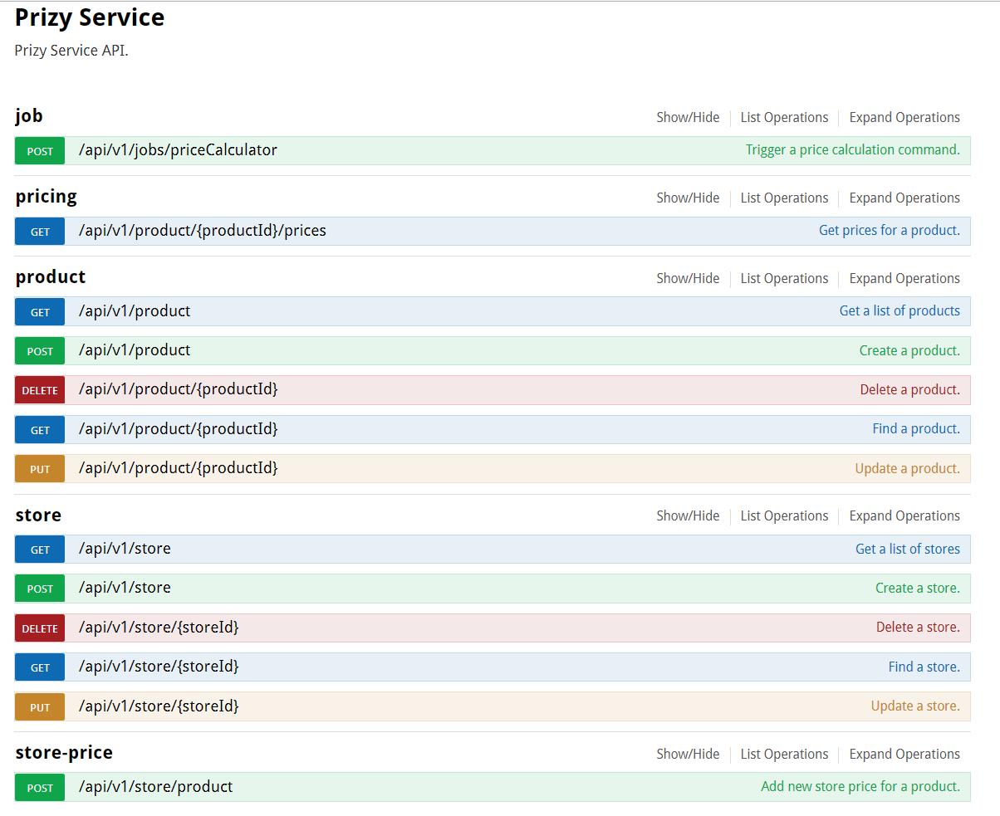
&nbsp;

#### Sample execution:
1. Product

    i. Getting a list of products

    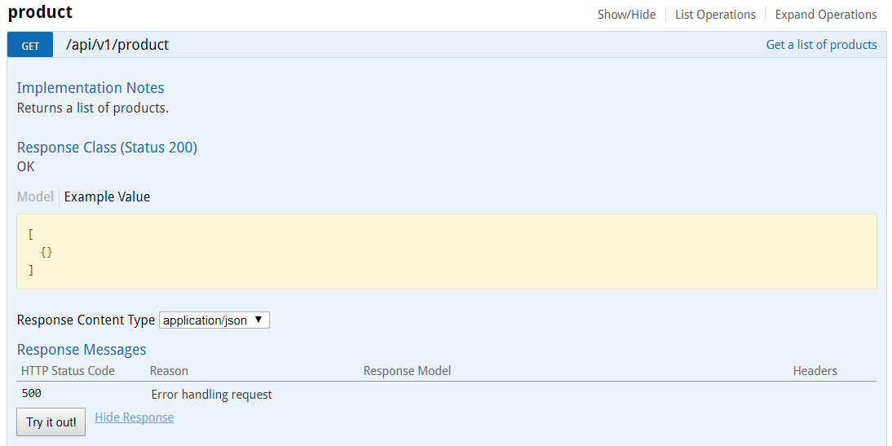
    &nbsp;

    ii. Creating a product

    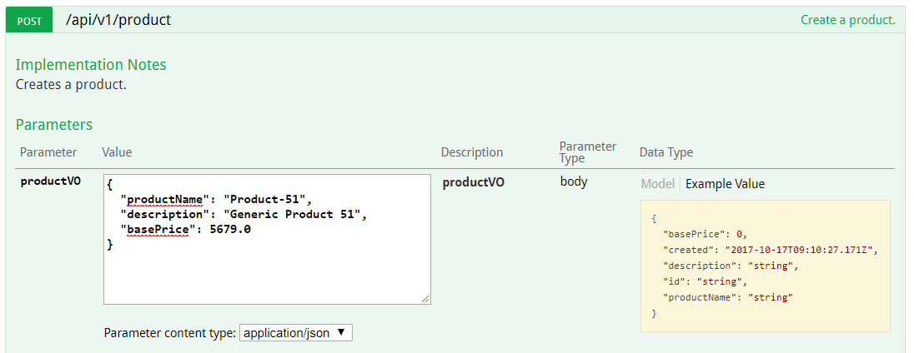

    Payload:
    ~~~
    {
      "productName": "Product-51",
      "description": "Generic Product 51",
      "basePrice": 5679.0
    }
    ~~~

    Returns the location of the new resource in the headers, for example:

    ~~~
    http://localhost:8080/api/v1/product/57346d95-a346-459c-8877-25e2127e1202
    ~~~
    Note: use the ID of this product for further API requests.
    &nbsp;

    iii. Finding a product

    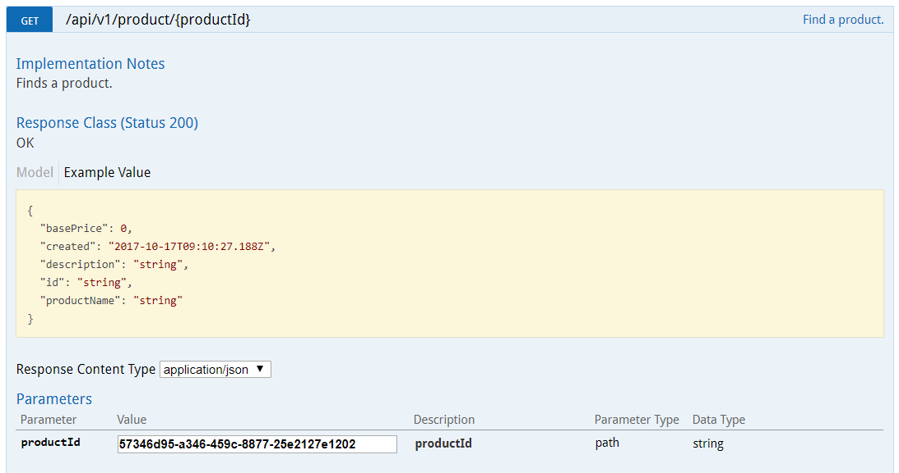

    Returns a representation of the product.
&nbsp;

2. Store

    i. Getting a list of stores

    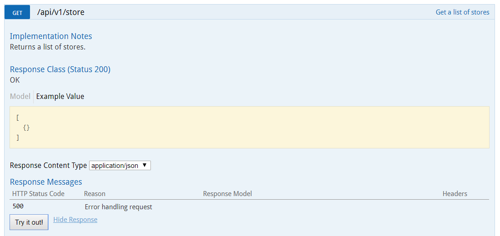
    &nbsp;

    ii. Creating a store

    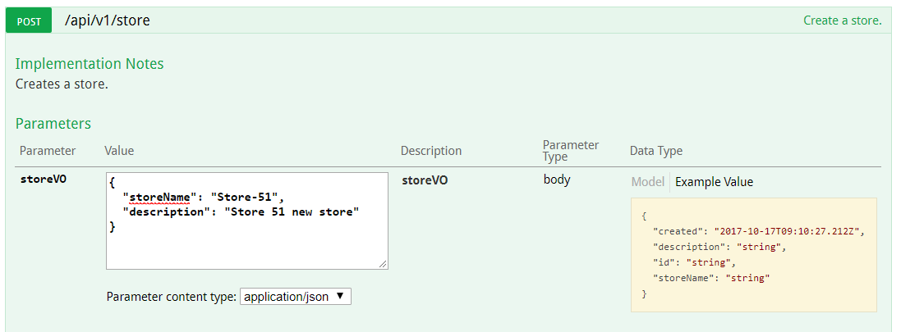

    Payload:
    ~~~
    {
      "storeName": "Store-51",
      "description": "Store 51 new store"
    }
    ~~~

    Returns the location of the new resource in the headers, for example:

    ~~~
    http://localhost:8080/api/v1/store/f918d379-e77e-47fa-a8ba-b0044d4e5c2d
    ~~~
    Note: use the ID of this store for further API requests.
    &nbsp;

    iii. Finding a store

    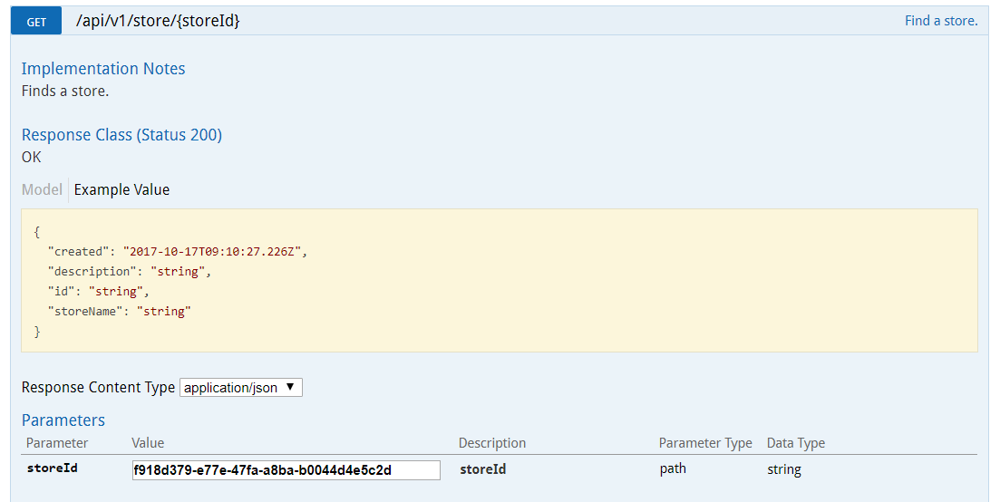

    Returns a representation of the store.
&nbsp;

3. Saving Store Price

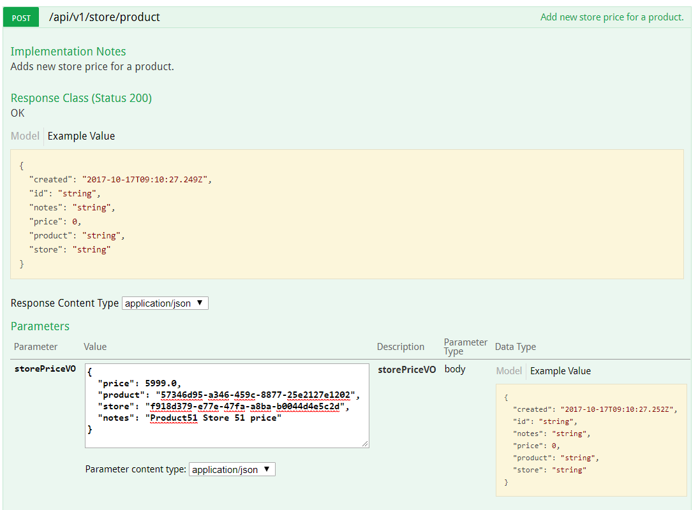

Payload:
~~~
{
  "price": 5999.0,
  "product": "57346d95-a346-459c-8877-25e2127e1202",
  "store": "f918d379-e77e-47fa-a8ba-b0044d4e5c2d",
  "notes": "Product51 Store 51 price"
}
~~~
&nbsp;

4. Triggering a Job
Command - start

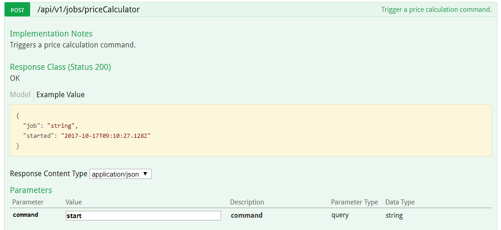
&nbsp;

5. Get pricing details for a Product
Use product Id - a4de46b6-cb70-4b8a-9b54-9c11baeb1a60

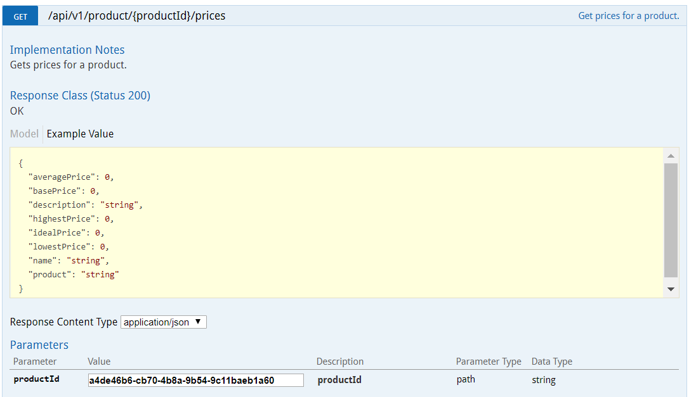

The response should be something like this:

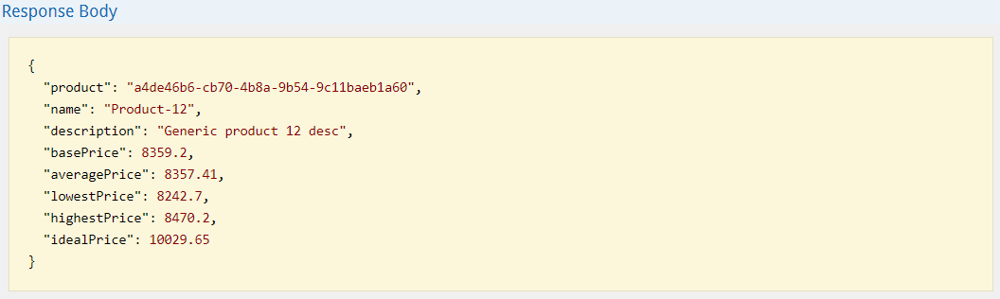

&nbsp;

### Database
- H2 embedded database (file-backed).
- Flyway migration for creating the schema and bootstrapping with sample data.
&nbsp;

### Unit Tests
Unit test for Service layer and MVC test for Controller are present in test module.
~~~
$ ./gradlew test
~~~
The test [reports](http://localhost:63342/prizy-pricing/build/reports/tests/test/) will be generated.
&nbsp;

### Pricing strategy
Pricing Strategy is controlled from application properties:
~~~
pricing:
  strategy: IDEAL
~~~

This is mapped to an enum `StrategyName` and resolved against the actual implementation of the strategy. For example, `StrategyName.IDEAL` maps to `IdealPricingServiceImpl`.

Each strategy needs to be annotated with `@PricingStrategy` to be identified as a valid strategy. The required strategy is picked up at runtime as per the above application property.
